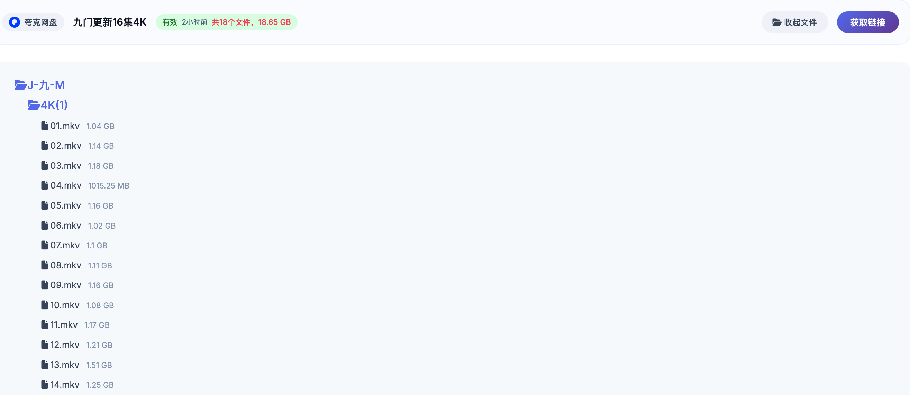
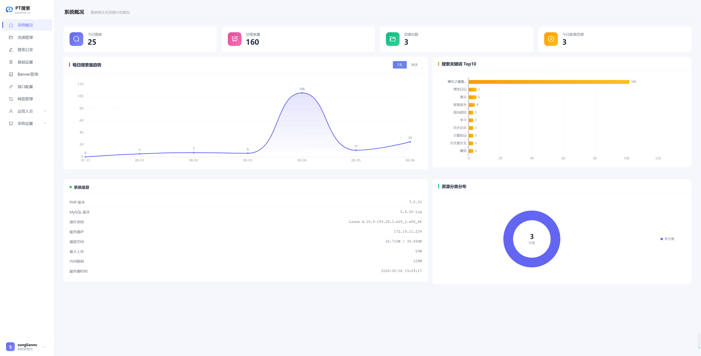
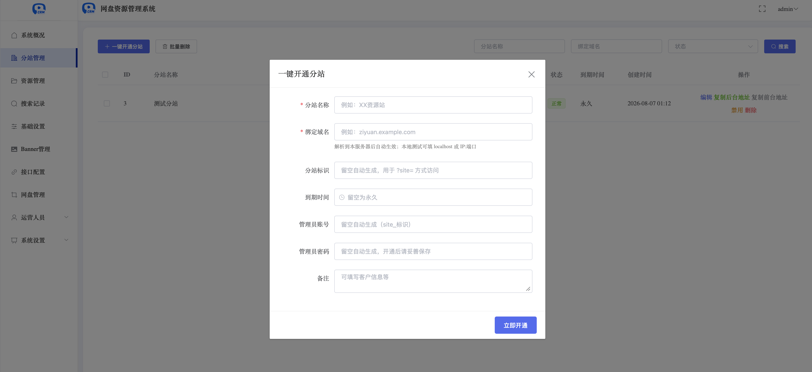

# 网盘资源搜索系统（xinyue-search · 分站版）

一个开箱即用的网盘资源搜索站 + **多租户分站系统**。

> 🌐 **在线体验：[www.pidanss.com](https://www.pidanss.com)**（可直接浏览前台搜索与后台功能）
>
> 📚 **[完整搭建教程](https://tcn6g7hyxvir.feishu.cn/wiki/WYT4wZtrjijeswkI0RSc4ofTnah)**（飞书文档）

- **前台**：网盘资源搜索（本地资源 + 全网搜）、热播榜、最近更新、分类浏览、搜索结果「查看文件」（递归展开网盘内文件）、一键获取资源链接；
- **后台**：系统概况仪表盘（真实数据统计）、资源管理、搜索记录、Banner 广告位管理、接口配置、网盘账号管理、分站管理；
- **分站系统**：主站后台一键开通分站，分站绑定独立域名、拥有独立后台（仅可改图标/广告/名称/联系方式等基础配置），搜索等功能继承主站；主站与各分站后台可同时登录。

> 本项目仅供技术交流与学习使用，不存储、不提供任何资源文件。请遵守当地法律法规，勿用于侵权用途。

---

## 界面预览

**前台 · 搜索结果与文件列表**



**后台 · 系统概况仪表盘（真实数据统计）**



**后台 · 分站管理（一键开通分站）**



---

## 一、环境要求

| 软件 | 要求 |
| --- | --- |
| PHP | **7.2 ~ 7.3**（原程序限制；PHP 8.x 兼容见文末） |
| Web 服务器 | Nginx（推荐）或 Apache |
| 数据库 | MySQL 5.6+（推荐 8.0，utf8mb4） |
| PHP 扩展 | mysql、curl、gd、openssl、mbstring、fileinfo |

---

## 二、部署教程

### 1. 上传源码

将整个项目上传到服务器（例如 `/var/www/xinyue-search`）。

### 2. 设置网站运行目录

Nginx 的 **root 指向 `public` 目录**：

```nginx
server {
    listen 80;
    server_name 你的域名.com;
    root /var/www/xinyue-search/public;
    index index.php index.html;
    client_max_body_size 20m;

    location ~ \.php$ {
        fastcgi_pass unix:/run/php/php7.2-fpm.sock;
        fastcgi_param SCRIPT_FILENAME $document_root$fastcgi_script_name;
        include fastcgi_params;
        fastcgi_read_timeout 60s;
    }

    location / {
        if (!-e $request_filename) {
            rewrite ^(.*)$ /index.php?s=/$1 last;
        }
    }

    location ~* \.(js|css|png|jpg|jpeg|gif|ico|svg|woff|woff2|ttf|eot)$ {
        expires 7d;
        add_header Cache-Control "public, immutable";
    }
}
```

Apache 用户使用项目自带的 `.htaccess` 即可（ThinkPHP 伪静态）。

### 3. 访问域名按向导安装

浏览器打开 `http://你的域名`，进入安装向导：

1. 同意许可协议；
2. 检查运行环境与目录权限（`runtime`、`public/install` 需可写）；
3. 填写数据库信息（**表前缀填 `qf_`**）；
4. 创建管理员账号；
5. 完成安装。

安装后会自动生成 `public/install/install.lock` 和 `.env`。

---

## 三、分站系统

### 1. 一键开通分站

主站后台 → **分站管理** → 一键开通分站，填分站名称、**绑定域名**、到期时间（留空永久）、管理员账号密码（留空自动生成）。开通后自动生成分站、独立后台账号与地址。

### 2. 分站域名解析

把分站域名解析（A 记录）到本服务器即可访问。

### 3.（可选）后台开通时自动生成该域名的 Nginx 配置

复制仓库 `scripts/update-subsite-nginx.sh` 到服务器并授权：

```bash
cp scripts/update-subsite-nginx.sh /usr/local/bin/update-subsite-nginx.sh
chmod 755 /usr/local/bin/update-subsite-nginx.sh
echo "www-data ALL=(root) NOPASSWD: /usr/local/bin/update-subsite-nginx.sh" > /etc/sudoers.d/subsite-nginx
chmod 440 /etc/sudoers.d/subsite-nginx
```

要求：PHP-FPM 以 `www-data` 运行、`exec()` 可用；如 php-fpm 开启 `ProtectSystem=full`，需加 systemd override `ReadWritePaths=/etc/nginx/sites-enabled`。

### 4. 分站管理员

- 后台地址：`http://分站域名/qfadmin/admin/login`；
- 仅可修改基础配置（名称/LOGO/icon/广告位/颜色/SEO/联系方式），**不能**动接口配置、网盘账号、资源等主站功能；
- 多个后台可同时登录。

---

## 四、可选：PanSou 全网搜

仓库自带 `public/pansou_proxy.php` 与 `public/pansou_server.php`（PanSou 代理工具，监听 127.0.0.1:8888 的 PanSou 服务）。部署 PanSou 后在后台「接口配置」添加线路即可使用第三方全网搜。本项目不内置任何第三方资源源。

---

## 五、常用命令

```bash
# 命令行一键开通分站
php think site:create --name="XX资源站" --domain=ziyuan.example.com

# 每日清理过期缓存（可加入 crontab）
php scripts/clean-cache.php
```

---

## 六、PHP 8.x 兼容

原程序限制 PHP 7.2~7.3。如需在 PHP 8.x 运行：

1. 注释 `public/index.php` 中的版本判断（16~17 行）；
2. 修改 `vendor/topthink/framework/src/think/initializer/Error.php`：`error_reporting(E_ALL)` → `error_reporting(E_ALL & ~E_DEPRECATED)`。

---

## 七、许可证

MIT（见 [LICENSE](LICENSE)）。

---

## 💬 交流 & 讨论

加入交流群，与更多开发者交流学习！

📌 **添加微信** `ty1000010`，添加时请备注来源（如果项目对你有所帮助，也可以请我喝杯咖啡 ☕️ ~）

📌 **扫码加入交流群** 👇


